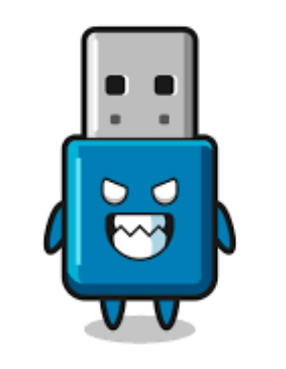

# BadUSB 

[BadUSB Exploit](https://www.wired.com/2014/07/usb-security/) proof of concept using Digispark Attiny85 board. Useful for executing payloads on unlocked machines.   

## Motivation
Human Interface Devices or HIDs (keyboards, mice, and any other input devices) are generally trusted by most personal computer systems. Host operating systems do not ask users for permission before allowing a new keyboard or mouse to send in input after being plugged in. This isn't a flaw however, it's a feature. Imagine if your computer asked you to click "yes" to use the mouse you plugged in. It would work on a laptop, but what if you were on a PC with no built in trackpad? You'd need something to click with already, which can't be assumed. Therefore HIDs must be plug and play by nature with no human interaction, which presents an opportunity to exploit.  

I'm a hacker. If I can control the keyboard and mouse, I can run malware on your computer. But to do that, I'd need to have direct physical access to the computer, putting myself at risk, right?. What if I didn't have to be there, and I could type at the speed of light? Enter BadUSB, a deadly and inherently unpatchable exploit that affects almost every computer with a USB port. 

## Implementation Details
The goal of this implementation is to achieve arbitrary code execution on the target machine. 

1. Attacker socially engineers victim into plugging in "BadUSB" device, which appears as a normal USB drive.
2. Device can now send keyboard/mouse commands over HID protocol through a USB Port.
3. Device quickly opens a terminal and executes a command to download and execute file. 

